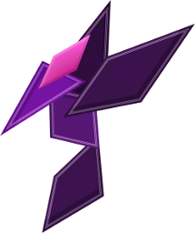

FEMRIS
======

Finite Element Method leaRnIng Software
---------------------------------------

FEMRIS es un programa educativo diseñado para el aprendizaje del [Método de Elementos Finitos]. Trabaja en conjunto a [MATLAB] o [GNU Octave], y brindando de una buena compatibilidad con el software [GiD].

Version
----

+ *0.1*
 + Actualmente se encuentra en una fase pre-alfa (última actualización: **20 de Octubre de 2014**).

Licencia
----

Liberado bajo una licencia **LGPL 2.1**: 

> This program is free software; you can redistribute it
> and/or modify it under the terms of the GNU Lesser General
> Public License (LGPL) as published by the Free Software
> Foundation; either version 2.1 of the License, or (at your
> option) any later version.
>
> This program is distributed in the hope that it will be
> useful, but WITHOUT ANY WARRANTY; without even the implied
> warranty of MERCHANTABILITY or FITNESS FOR A PARTICULAR
> PURPOSE. See the GNU Library General Public License for
> more details.
>
> License File* at http://www.gnu.org/licenses/lgpl.txt

**Free Software, Hell Yeah!**

[Método de Elementos Finitos]:http://es.wikipedia.org/wiki/M%C3%A9todo_de_los_elementos_finitos
[MATLAB]:http://www.mathworks.com/products/matlab/
[GNU Octave]:https://www.gnu.org/software/octave/
[GiD]:http://www.gidhome.com/
